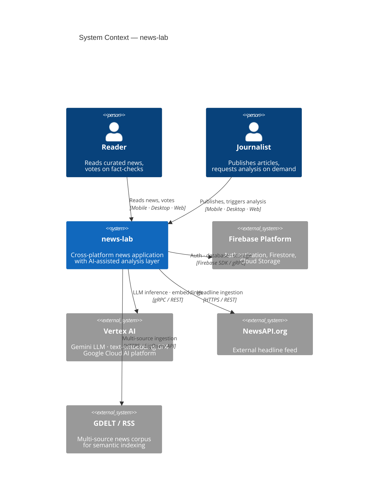
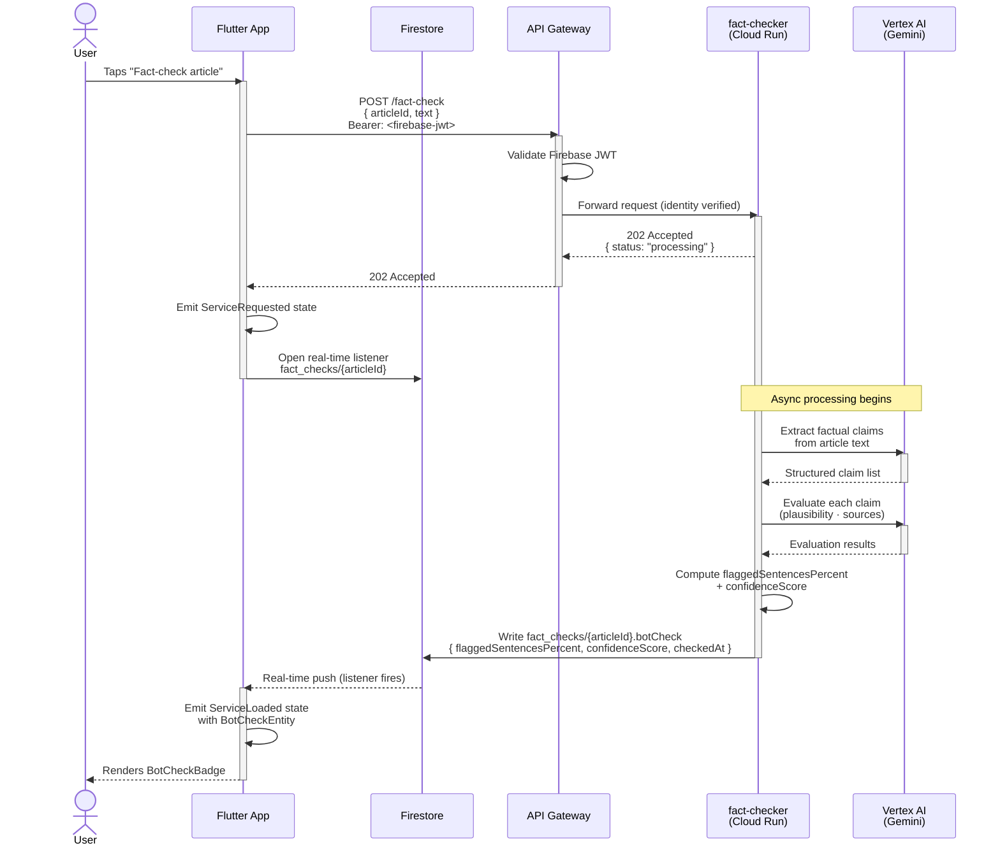
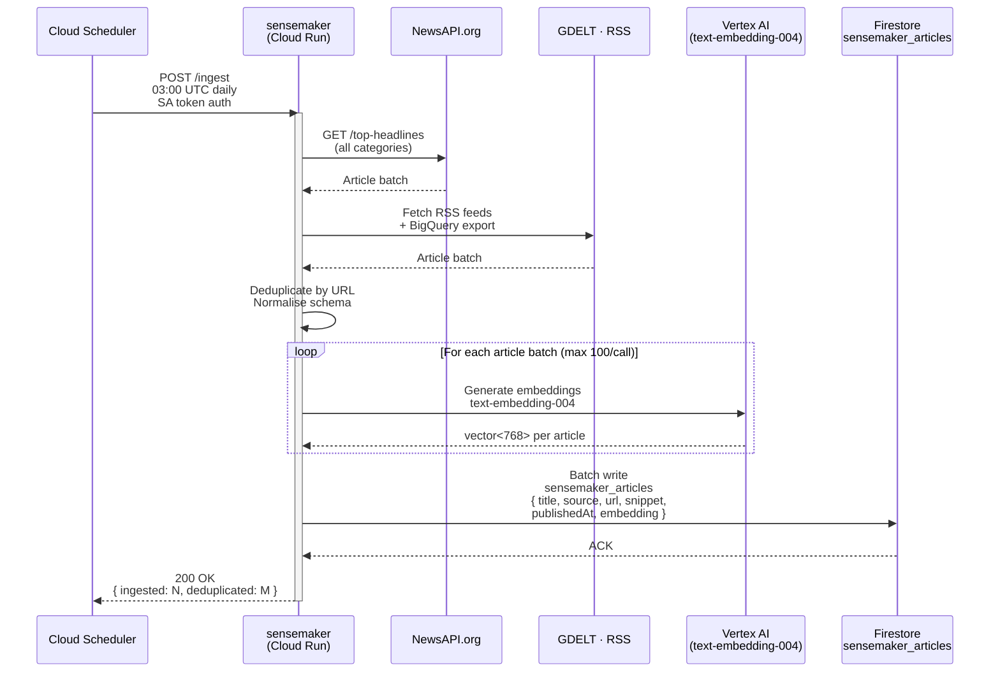
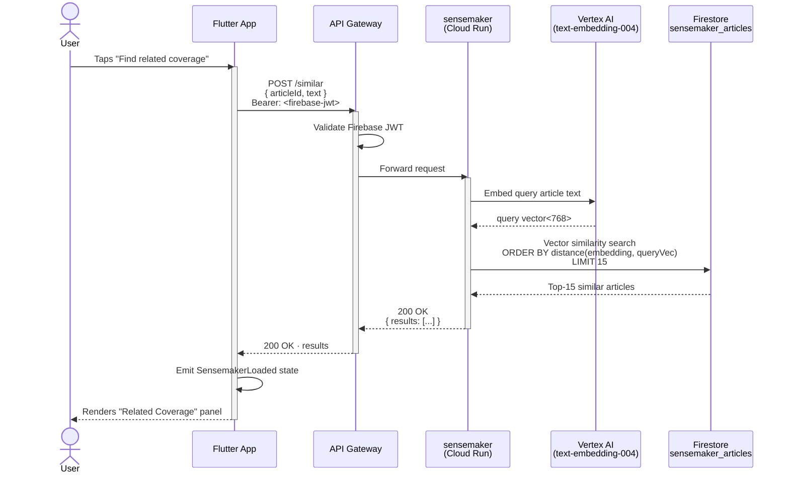
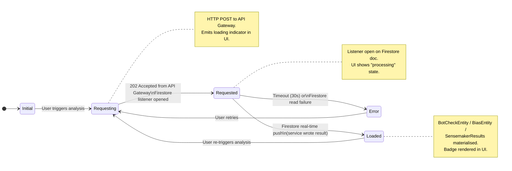
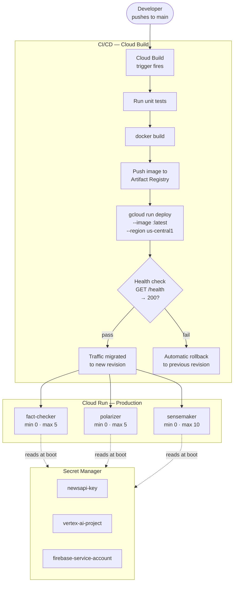
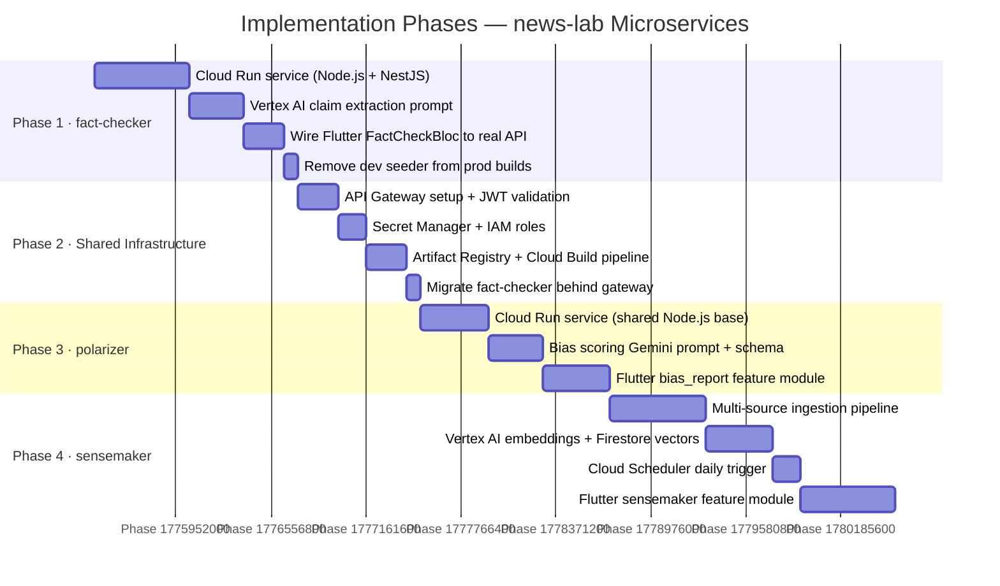

# news-lab: Architecture Diagrams
**Companion to:** `ARCHITECTURE_EXPANSION.md`  
**Notation:** C4 Model (L1 Context → L2 Container) + UML Sequence

---

## Diagram 1 — System Context (C4 Level 1)

> Who uses the system and what external systems does it depend on.

---

## Diagram 2 — Container Architecture (C4 Level 2)

> Every deployable unit, its technology, and how they communicate.

```mermaid
C4Container
    title Container Diagram — news-lab Microservices Expansion

    Person(user, "User", "Reader or Journalist")

    System_Boundary(client, "Client Layer") {
        Container(flutter, "Flutter App", "Dart · Flutter 3", "Cross-platform UI.<br/>BLoC state management.<br/>Clean Architecture feature modules.")
    }

    System_Boundary(gateway_layer, "Edge Layer — GCP") {
        Container(gateway, "API Gateway", "GCP API Gateway", "Single ingress point.<br/>Firebase JWT validation.<br/>Rate limiting · routing.")
    }

    System_Boundary(services, "Service Layer — GCP Cloud Run") {
        Container(factchecker, "fact-checker", "Node.js · NestJS · Cloud Run", "Extracts factual claims.<br/>Evaluates against corpus.<br/>Writes botCheck to Firestore.")
        Container(polarizer, "polarizer", "Node.js · NestJS · Cloud Run", "Scores political lean,<br/>emotional language, framing.<br/>Writes biasReport to Firestore.")
        Container(sensemaker, "sensemaker", "Node.js · NestJS · Cloud Run", "Ingests multi-source news.<br/>Generates vector embeddings.<br/>Serves semantic similarity queries.")
    }

    System_Boundary(data, "Data Layer — GCP") {
        ContainerDb(firestore, "Firestore", "Google Cloud Firestore", "articles · fact_checks<br/>sensemaker_articles · categories<br/>Real-time listeners to client.")
        ContainerDb(vertexai, "Vertex AI", "Gemini 1.5 Flash · Pro<br/>text-embedding-004", "LLM inference for all services.<br/>Vector embedding generation.")
        ContainerDb(secretmgr, "Secret Manager", "GCP Secret Manager", "NewsAPI key · service<br/>account credentials.")
    }

    System_Boundary(ops, "Ops Layer — GCP") {
        Container(scheduler, "Cloud Scheduler", "GCP Cloud Scheduler", "Triggers sensemaker<br/>/ingest daily at 03:00 UTC.")
        Container(registry, "Artifact Registry", "GCP Artifact Registry", "Versioned Docker images<br/>for all Cloud Run services.")
        Container(cloudbuild, "Cloud Build", "GCP Cloud Build", "CI/CD pipeline.<br/>Build → push → deploy<br/>on push to main.")
    }

    System_Ext(firebase_auth, "Firebase Auth", "JWT issuance · user identity")
    System_Ext(newsapi_ext, "NewsAPI.org", "Top headlines feed")
    System_Ext(gdelt_ext, "GDELT · RSS Feeds", "BBC · Reuters · AP · Al Jazeera")

    %% Client ↔ Firebase Auth
    Rel(user, flutter, "Uses", "HTTPS")
    Rel(flutter, firebase_auth, "Sign in · get JWT", "Firebase SDK")

    %% Client ↔ Data (real-time reads)
    Rel(flutter, firestore, "Real-time listeners<br/>(articles · fact_checks · bias)", "Firebase SDK · WebSocket")

    %% Client → Edge → Services (on-demand triggers)
    Rel(flutter, gateway, "POST /fact-check<br/>POST /polarize<br/>POST /similar", "HTTPS · Bearer JWT")
    Rel(gateway, factchecker, "Routes validated request", "HTTPS")
    Rel(gateway, polarizer, "Routes validated request", "HTTPS")
    Rel(gateway, sensemaker, "Routes validated request", "HTTPS")

    %% Services → AI
    Rel(factchecker, vertexai, "Claim extraction · evaluation", "gRPC")
    Rel(polarizer, vertexai, "Bias scoring", "gRPC")
    Rel(sensemaker, vertexai, "Embedding generation", "gRPC")

    %% Services → Firestore (async writes)
    Rel(factchecker, firestore, "Writes fact_checks/{id}.botCheck", "gRPC")
    Rel(polarizer, firestore, "Writes articles/{id}.biasReport", "gRPC")
    Rel(sensemaker, firestore, "Writes sensemaker_articles", "gRPC")

    %% Services → Secrets
    Rel(factchecker, secretmgr, "Reads credentials at boot", "gRPC")
    Rel(polarizer, secretmgr, "Reads credentials at boot", "gRPC")
    Rel(sensemaker, secretmgr, "Reads credentials at boot", "gRPC")

    %% Ops → Services
    Rel(scheduler, sensemaker, "POST /ingest (daily 03:00 UTC)", "HTTPS · SA token")
    Rel(cloudbuild, registry, "Pushes Docker image", "")
    Rel(registry, factchecker, "Pulls image on deploy", "")
    Rel(registry, polarizer, "Pulls image on deploy", "")
    Rel(registry, sensemaker, "Pulls image on deploy", "")

    %% Sensemaker → External sources
    Rel(sensemaker, newsapi_ext, "Fetches headlines", "HTTPS · REST")
    Rel(sensemaker, gdelt_ext, "Fetches multi-source corpus", "HTTPS · BigQuery API")
```

---

## Diagram 3 — On-Demand Analysis Flow (UML Sequence)

> What happens end-to-end when a journalist taps "Check this article."  
> The same flow applies to `polarizer` — only the endpoint and Firestore field change.

---

## Diagram 4 — Sensemaker Ingestion Flow (UML Sequence)

> Background pipeline. Runs daily via Cloud Scheduler. No user interaction.

---

## Diagram 5 — On-Demand Similarity Query (UML Sequence)

> sensemaker's query path is synchronous — the only service that responds with data directly.

---

## Diagram 6 — Flutter BLoC State Machine

> Canonical state machine implemented by every microservice BLoC in the Flutter app.  
> Applies identically to `FactCheckBloc`, `BiasReportBloc`, and `SensemakerBloc`.

---

## Diagram 7 — Deployment & Build Pipeline

> How code moves from a developer's machine to a running Cloud Run service.

---

## Diagram 8 — Implementation Phases

> Build order and dependencies between phases.

